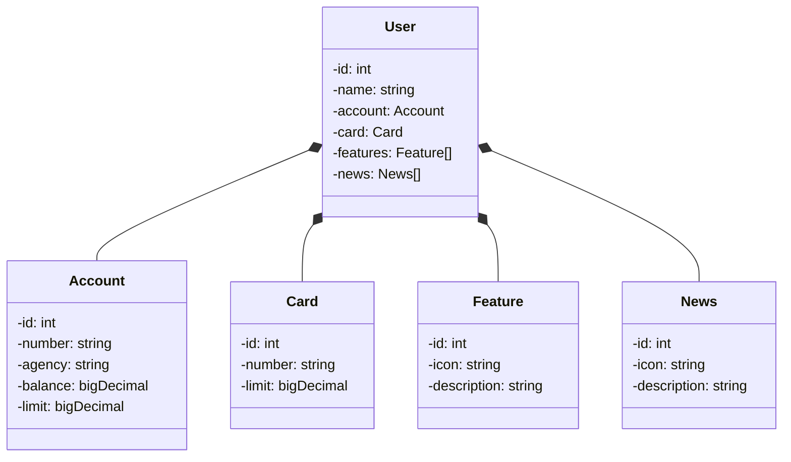

## RestAPI Application

### Domain Diagram

```mermaid
classDiagram
  class User {
    -id: int
    -name: string
    -account: Account
    -card: Card
    -features: Feature[]
    -news: News[]
  }

  class Account {
    -id: int
    -number: string
    -agency: string
    -balance: bigDecimal
    -limit: bigDecimal
  }

  class Card {
    -id: int
    -number: string
    -limit: bigDecimal
  }

  class Feature {
    -id: int
    -icon: string
    -description: string
  }

  class News {
    -id: int
    -icon: string
    -description: string
  }

  User *-- Account
  User *-- Card
  User *-- Feature
  User *-- News
```