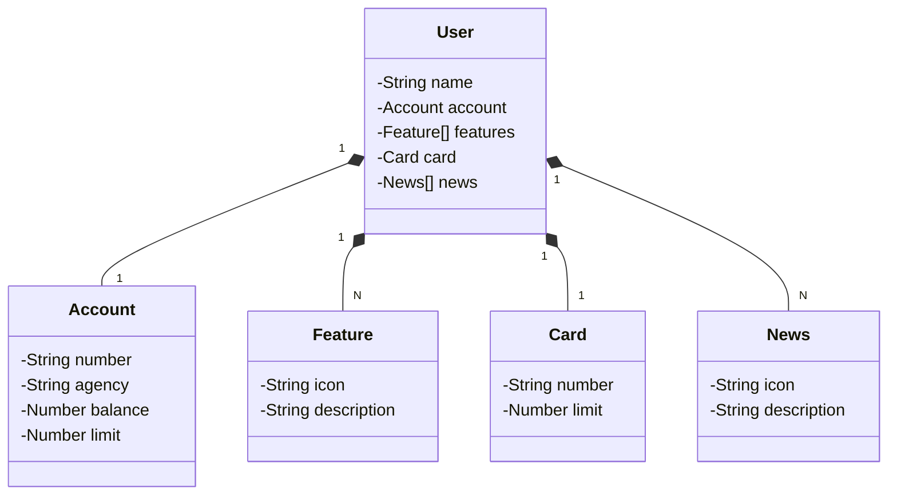

# RestAPI Application
Simple api testing Railway platform

    
     
    
    
    
    
    
    
    
    
    

## Class Diagram

## API Documentation
Public api is accessible at the following endpoint
[public-api](https://web-production-e701.up.railway.app/swagger-ui/index.html)